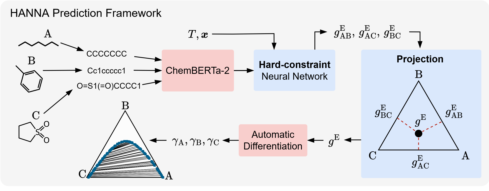

# HANNA
[](https://pubs.rsc.org/en/Content/ArticleLanding/2024/SC/D4SC05115G)
[](./LICENSE)
[](https://ml-prop.mv.rptu.de/)


<p align="center">
  
</p>

HANNA is a machine learning model for predicting the excess Gibbs energy of the liquid phase in mixtures with an arbitrary number of components. Through automatic differentiation, HANNA derives thermodynamically consistent activity coefficients from the excess Gibbs energy. HANNA is trained to more than 300,000 binary experimental data points of vapor-liquid equilibria, infinite dilution activity coefficients and liquid-liquid equilibria. As input, only the SMILES notation and the considered state point is required. In comprehensive benchmarks, HANNA was found to yield better results than the state-of-the-art models of the UNIFAC family.

**Note**: This repository is based on the HANNA prototype implementation by [tspecht93](https://github.com/tspecht93/HANNA), which was restricted to binary mixtures and not trained on liquid-liquid equilibrium data; the corresponding original paper is available [here](https://pubs.rsc.org/en/Content/ArticleLanding/2024/SC/D4SC05115G).


### Easy Use
You can explore HANNA and other models from our working group on our interactive web interface, [MLPROP](https://ml-prop.mv.rptu.de/), without any installation.
<p align="center">
  <a href="https://ml-prop.mv.rptu.de/">
    
  </a>
</p>

## Installation

To set up the project, follow these steps:

1. **Clone the repository:**

   ```bash
   git clone https://github.com/marco-hoffmann/HANNA.git
   cd HANNA
   ```

2. **Create the conda environment:**

   Use the provided `.yml` file to create the conda environment.

   ```bash
   conda env create -f environment.yml
   ```

4. **Activate the environment:**

   ```bash
   conda activate HANNA_environment
   ```

## Usage

You can use the `demo.ipynb` notebook, which provides a demonstration of how to calculate excess Gibbs energies andactivity coefficients for a multi-component mixtures.

## License

This project is licensed under the MIT License. See the LICENSE file for details.
